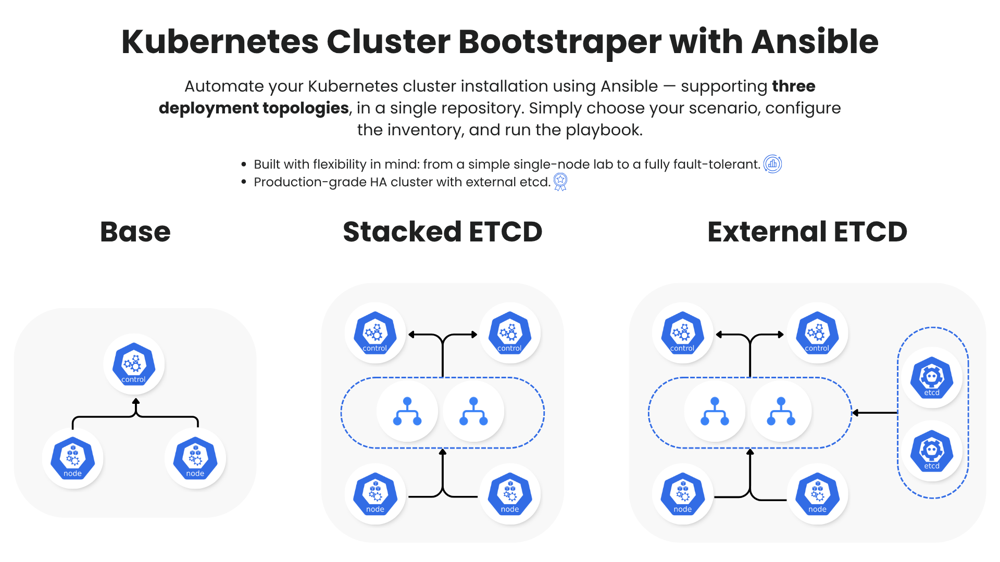

# Kubernetes Cluster Bootstrapper with Ansible

Ansible playbook to automate Kubernetes cluster installation, supporting **three deployment topologies** in a single repository.

---

## Supported Scenarios

This project supports three Kubernetes deployment topologies, ranging from a simple single-node setup for development purposes to a fully fault-tolerant production-grade HA cluster. Choose the scenario that best fits your infrastructure needs.

| Scenario | Description | Best For |
|---|---|---|
| `base` | Single control-plane, no High Availability | Development / Lab |
| `stacked_etcd` | HA control-plane, etcd stacked with master nodes | Simple Production HA |
| `external_etcd` | HA control-plane, etcd on dedicated nodes | Full Production HA |



---

## Prerequisites

- Ansible >= 2.12
- Python >= 3.8
- SSH access to all nodes
- Nodes running Ubuntu 20.04/22.04 or Debian 11/12

### Install Ansible Dependencies
```bash
ansible-galaxy install -r requirements.yaml
```

---

## Usage

### 1. Select a Scenario

Edit the `cluster_topology` variable in `group_vars/all.yml`:

```yaml
# Choose one of: base | stacked_etcd | external_etcd
cluster_topology: "base"
```

### 2. Configure the Inventory

Edit the inventory file for your chosen scenario:

| Scenario | Inventory File |
|---|---|
| `base` | `inventory/base` |
| `stacked_etcd` | `inventory/stacked_etcd` |
| `external_etcd` | `inventory/external_etcd` |

### 3. Configure Variables

Edit `group_vars/all.yml` to match your environment:

```yaml
# For base scenario
apiserver_advertise_address: "192.168.1.10"

# For stacked_etcd / external_etcd scenarios
lb_ip: "10.0.0.110"
vip_prefix: "24"
keepalived_interface: "eth0"
```

For `stacked_etcd` / `external_etcd` scenarios, also configure `host_vars/`:
- `host_vars/k8s-lb1.yml` — `keepalived_state: MASTER`, `keepalived_priority: 150`
- `host_vars/k8s-lb2.yml` — `keepalived_state: BACKUP`, `keepalived_priority: 100`

### 4. Run the Playbook

```bash
# Base scenario
ansible-playbook site.yml -i inventory/base

# Stacked etcd scenario
ansible-playbook site.yml -i inventory/stacked_etcd

# External etcd scenario
ansible-playbook site.yml -i inventory/external_etcd
```

### Run with Specific Tags

```bash
# Only install common packages and container runtime
ansible-playbook site.yml -i inventory/base --tags "common,container-runtime"

# Only deploy addons
ansible-playbook site.yml -i inventory/base --tags addons
```

---

## Configuration

### Kubernetes

| Variable | Default | Description |
|---|---|---|
| `kubernetes_version` | `1.28.0` | Kubernetes version |
| `cluster_name` | `example-test` | Cluster name |
| `pod_network_cidr` | `10.244.0.0/16` | Pod network CIDR |
| `service_network_cidr` | `10.96.0.0/12` | Service network CIDR |

### CNI Plugin

| Variable | Default | Options |
|---|---|---|
| `cni_plugin` | `calico` | `calico`, `flannel`, `cilium` |

### Container Runtime

| Variable | Default | Options |
|---|---|---|
| `container_runtime` | `containerd` | `containerd`, `docker`, `cri-o` |

### Addons (Available for All Scenarios)

Enable addons in `group_vars/all.yml`:

```yaml
addons:
  helm:
    enabled: true
    version: "v3.17.3"

  metallb:
    enabled: true
    ip_range: "192.168.1.240-192.168.1.250"

  metrics_server:
    enabled: true

  argocd:
    enabled: true

  longhorn:
    enabled: true

  istio:
    enabled: true
    profile: "default"
```

---

## Project Structure

```
k8s-ansible/
├── ansible.cfg
├── site.yml                    # Main playbook (multi-scenario)
├── requirements.yaml
├── docs/
│   └── topology.png            # Cluster topology diagram
├── inventory/
│   ├── base                    # Inventory for base scenario
│   ├── stacked_etcd            # Inventory for stacked HA scenario
│   └── external_etcd           # Inventory for external etcd HA scenario
├── group_vars/
│   └── all.yml                 # All variables + cluster_topology selector
├── host_vars/
│   ├── k8s-lb1.yml             # Keepalived config for LB1 (MASTER)
│   └── k8s-lb2.yml             # Keepalived config for LB2 (BACKUP)
└── roles/
    ├── common/                 # Prerequisite tasks for all nodes
    ├── container-runtime/      # Install containerd/docker/cri-o
    ├── kubernetes/             # Install kubeadm, kubelet, kubectl
    ├── lb/                     # Setup HAProxy + Keepalived (HA only)
    ├── etcd/                   # Setup external etcd cluster (external_etcd only)
    ├── master/                 # Initialize control-plane
    ├── master-join/            # Join additional control-plane nodes (HA only)
    ├── worker/                 # Join worker nodes
    ├── cni/                    # Deploy CNI plugin
    └── addons/                 # Deploy optional addons
```
